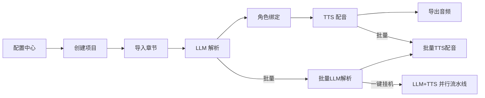

# 📚 HX-SayBook

> AI 多角色多情绪小说配音平台 (基于 [SonicVale / 音谷](https://github.com/xcLee001/SonicVale) 二次开发)

将小说文本通过 LLM 自动拆分为带角色、情绪的台词, 再通过 TTS (如 Index-TTS) 合成多角色配音音频, 最终导出 MP3 + SRT/ASS 字幕。

[](LICENSE)

---

## 📖 目录

- [功能亮点](#-功能亮点)
- [技术架构](#-技术架构)
- [项目结构](#-项目结构)
- [环境要求](#-环境要求)
- [快速开始](#-快速开始)
- [配置 Index-TTS](#-配置-index-tts)
- [使用流程](#-使用流程)
- [API 概览](#-api-概览)
- [已知问题与注意事项](#-已知问题与注意事项)

---

## ✨ 功能亮点

### 核心能力

| 功能 | 说明 |
|------|------|
| 🎯 **批量 LLM 解析** | 选择章节范围批量队列转化, 支持 1~10 并发控制, WebSocket 实时推送日志和进度, 可随时取消 |
| 🎙️ **批量 TTS 配音** | 按章节批量配音, WebSocket 实时推送每条台词的合成进度 |
| 🔄 **LLM + TTS 并行流水线** | 一键挂机模式下 LLM 解析与 TTS 配音并行执行, 大幅缩短整体耗时 |
| ⚡ **异步协程引擎** | LLM/TTS 引擎全面 async 非阻塞调用, SQLite StaticPool 连接池, 高并发下不阻塞事件循环 |
| 📝 **字幕导出** | 支持 SRT/ASS 双格式字幕, 根据每条台词音频实际时长精确计算时间轴 |

### 配音细节

| 功能 | 说明 |
|------|------|
| 🎭 **复合情绪系统** | 18 种情绪 (8 基础 + 10 复合), 基于 Plutchik 情绪轮的多维向量组合, Index-TTS 8 维情绪向量映射 |
| 🎚️ **5 级强度调节** | 微弱/稍弱/中等/较强/强烈, 线性缩放情绪向量 |
| 🔊 **语音速度调节** | 全局/单条台词速度调节, 0.5x ~ 2.0x, 基于 ffmpeg atempo 滤镜 |
| 🎭 **路人语音池** | 为项目配置候选音色池, 自动随机分配给未绑定角色 |
| 🧠 **情绪校验 + 自动修正** | LLM 输出的情绪若不在合法列表中, 自动发起修正请求, 失败则 fallback 到 "平静" |
| 🔄 **速率限制自动退避** | 遇到 429/rate limit 自动指数退避重试 (15s→30s→60s→120s), 每段最多重试 5 次 |

### 导出与管理

| 功能 | 说明 |
|------|------|
| 🎬 **单章一键导出** | 合并音频转 MP3 + 生成 SRT/ASS 字幕, 一键打包 |
| 📦 **合并导出分段** | 支持按章节数或时长分段合并, 以章节为最小单位不截断对话 |
| ⏭️ **跳过已解析章节** | 批量 LLM 解析时自动跳过已有台词的章节, 可手动关闭 |
| 🎤 **音色上传管理** | 支持上传 WAV/MP3/FLAC/OGG/M4A 参考音频创建音色, 音色卡片支持试听和删除 |
| 🔧 **独立语音调试** | 脱离业务流程, 快速测试音色/情绪/速度组合, 调试结果保存到 debug 目录 |
| 🇯🇵 **中日语切换** | 项目级别语言设置, Index-TTS API Server 动态加载/卸载中日语模型 |

---

## 🏗️ 技术架构

```
┌───────────────┐    HTTP/WS    ┌──────────────────┐    HTTP     ┌───────────────┐
│  React 前端   │ ◄──────────► │  FastAPI 后端     │ ──────────► │  Index-TTS    │
│  (Vite + TS)  │    :3000     │  (Python 3.10+)  │    :8000   │  API Server   │
└───────────────┘              └──────────────────┘             └───────────────┘
                                        │                              │
                               ┌────────┴────────┐                    │
                               │   SQLite DB     │            GPU / CPU
                               │ (py/user_data/) │
                               └─────────────────┘
```

| 模块 | 技术 |
|------|------|
| 后端 | Python 3.10+ / FastAPI / SQLAlchemy / Pydantic v2 / WebSocket |
| 前端 | React 19 / TypeScript 5.9 / Vite 6 / Ant Design 6 / Zustand 5 |
| TTS | Index-TTS (可选) / 任何兼容 `/v2/synthesize` 接口的 TTS 服务 |
| LLM | OpenAI 兼容 API (通过 `openai` SDK, 支持任意兼容服务商) |
| 音频处理 | ffmpeg (变速/裁剪/合并/格式转换) / soundfile + numpy (软限幅/归一化) |
| 字幕 | 自研时间轴生成 (根据音频实际时长) + 可选 ASR 矫正 (B站/剪映/Whisper) |
| 包管理 | uv (Python) / npm (前端) |

---

## 📁 项目结构

```
HX-SayBook/
├── py/                          # 后端 (FastAPI)
│   ├── main.py                  # 入口: FastAPI 实例, 路由注册, 生命周期, 数据库迁移
│   ├── core/                    # 核心引擎
│   │   ├── llm_engine.py        # LLM 调用 (同步+异步, 重试退避, JSON修复)
│   │   ├── tts_engine.py        # TTS 调用 (同步+异步, httpx/requests)
│   │   ├── tts_runtime.py       # TTS 异步队列消费者, 情绪→向量转换
│   │   ├── audio_engin.py       # 音频处理 (ffmpeg: 裁剪/静音/变速/音量)
│   │   ├── subtitle_export.py   # 字幕导出 (SRT/ASS, 根据音频时长生成时间轴)
│   │   ├── text_correct_engine.py # 精准填充 (difflib 文本匹配校正)
│   │   ├── prompts.py           # LLM 提示词模板
│   │   ├── config.py            # 路径配置 (数据目录/ffmpeg)
│   │   ├── ws_manager.py        # WebSocket 广播管理
│   │   ├── response.py          # 统一响应格式 Res[T]
│   │   └── subtitle/            # ASR 字幕引擎 (B站/剪映/Whisper)
│   ├── routers/                 # API 路由层
│   │   ├── batch_router.py      # 批量处理 (批量LLM/TTS/一键挂机/语音调试)
│   │   ├── chapter_router.py    # 章节管理 + LLM解析
│   │   ├── line_router.py       # 台词管理 + 音频生成/导出
│   │   ├── project_router.py    # 项目 CRUD + 小说导入
│   │   ├── role_router.py       # 角色管理 + 路人语音池分配
│   │   ├── voice_router.py      # 音色管理 + 音频上传/导入导出
│   │   └── ...                  # 情绪/强度/LLM供应商/TTS供应商/提示词
│   ├── services/                # 业务逻辑层
│   ├── repositories/            # 数据访问层
│   ├── models/po.py             # SQLAlchemy ORM 模型 (11 张表)
│   ├── entity/                  # 业务实体
│   ├── dto/                     # 数据传输对象
│   ├── db/database.py           # 数据库连接 (SQLite + StaticPool)
│   └── user_data/               # 用户数据 (数据库/音频/音色)
├── web/                         # 前端 (React + TS)
│   └── src/
│       ├── App.tsx              # 路由 + 侧边栏布局
│       ├── api/                 # Axios 封装 + API 接口定义
│       ├── pages/               # 页面组件
│       │   ├── ProjectDetail.tsx # 项目详情 (章节/台词/配音 主工作区)
│       │   ├── ProjectList.tsx  # 项目列表
│       │   ├── ConfigCenter.tsx # 配置中心 (LLM/TTS 供应商)
│       │   ├── VoiceManager.tsx # 音色管理
│       │   ├── VoiceDebug.tsx   # 语音调试
│       │   └── PromptManager.tsx # 提示词管理
│       ├── components/          # 可复用组件
│       │   ├── AutoPilotModal.tsx # 一键挂机弹窗
│       │   ├── BatchLLMModal.tsx  # 批量LLM弹窗
│       │   ├── BatchTTSModal.tsx  # 批量TTS弹窗
│       │   ├── SpeedControl.tsx   # 速度调节组件
│       │   └── LogPanel.tsx       # 日志面板
│       ├── hooks/               # 自定义 Hook
│       │   ├── useWebSocket.ts  # WebSocket 连接 + 自动重连 + 心跳
│       │   └── useChapterLazyList.ts # 章节懒加载 + 分页
│       ├── store/index.ts       # Zustand 全局状态
│       └── types/index.ts       # TypeScript 类型定义
├── scripts/                     # 工具脚本
│   ├── install_index_tts.sh     # Index-TTS 一键安装
│   ├── run_index_tts.sh         # Index-TTS 启动脚本
│   └── api_server.py            # Index-TTS API Server (独立运行)
├── pyproject.toml               # Python 项目配置 (uv)
├── start.sh                     # Linux 启动脚本
└── start.bat                    # Windows 启动脚本
```

---

## 🔧 环境要求

| 依赖 | 版本 | 说明 |
|------|------|------|
| Python | 3.10+ | 后端运行环境 |
| Node.js | 18+ | 前端构建环境 |
| ffmpeg | 任意版本 | 音频处理 (系统 PATH 中, 或放到 `py/core/ffmpeg/` 下) |
| GPU + CUDA | 可选 | Index-TTS GPU 加速 (CPU 模式也可用, 但较慢) |

---

## 🚀 快速开始

### 1. 启动后端

```bash
# 方式一: 使用启动脚本 (推荐, 自动安装 uv 和依赖)
chmod +x start.sh
./start.sh

# 方式二: 手动启动
uv sync
uv run uvicorn py.main:app --host 0.0.0.0 --port 8200 --reload
```

后端启动后:
- API 地址: `http://localhost:8200`
- 健康检查: `http://localhost:8200/api/health`
- API 文档: `http://localhost:8200/docs` (Swagger UI)

### 2. 启动前端

```bash
cd web
npm install
npm run dev
# 访问 http://localhost:3000
```

前端通过 Vite proxy 自动将 `/api` 请求代理到后端 `:8200`, WebSocket 同样自动代理。

### 3. (可选) 构建前端生产版本

```bash
cd web
npm run build
# 产物在 web/dist/, 可部署到任意静态服务器
```

---

## 🔌 配置 Index-TTS

Index-TTS 是高质量零样本语音克隆模型, 支持多情绪合成。

### 一键安装

```bash
chmod +x scripts/install_index_tts.sh
./scripts/install_index_tts.sh
```

脚本自动完成: 克隆仓库 → 检测 GPU/CPU → 安装依赖 → 下载模型 → 创建启动脚本。

> ⚠️ 无 NVIDIA GPU 时会自动安装 CPU 版 PyTorch, 功能完整但推理较慢。

### 手动下载模型

模型文件放在 `scripts/index-tts/checkpoints/` 下:

```bash
# 方式1: ModelScope (国内推荐)
pip install modelscope
modelscope download --model IndexTeam/IndexTTS-2 --local_dir scripts/index-tts/checkpoints

# 方式2: HuggingFace 镜像站
pip install huggingface_hub[cli]
HF_ENDPOINT=https://hf-mirror.com hf download IndexTeam/IndexTTS-2 --local-dir scripts/index-tts/checkpoints

# 方式3: HuggingFace 官方
pip install huggingface_hub[cli]
hf download IndexTeam/IndexTTS-2 --local-dir scripts/index-tts/checkpoints
```

### 启动 TTS 服务

```bash
cd scripts/index-tts
./start_tts_server.sh
# 或手动: source .venv/bin/activate && python api_server.py --host 0.0.0.0 --port 8000
```

### 对接 HX-SayBook

1. 打开前端 → **配置中心**
2. 找到 TTS 供应商 `index_tts` (系统自动创建)
3. 填入 API 地址: `http://127.0.0.1:8000`
4. **测试连接** → 显示成功即可

---

## 📖 使用流程



1. **配置中心** — 添加 LLM 提供商 (OpenAI 兼容 API) 和 TTS 提供商 (Index-TTS 等)
2. **创建项目** — 关联 LLM/TTS 供应商, 选择模型和提示词, 设置语言
3. **导入章节** — 粘贴小说全文, 自动按章节标题分割; 或逐章添加
4. **LLM 解析** — 单章或批量解析, 自动拆分为台词并识别角色/情绪/强度
5. **角色绑定** — 手动为角色分配音色, 或使用路人语音池随机分配
6. **TTS 配音** — 单条试听或批量配音, WebSocket 实时查看进度
7. **语音调试** — 在独立页面微调音色/情绪/速度组合
8. **导出音频** — 单章导出 MP3+字幕, 或多章合并导出 (支持按时长分段)

---

## � API 概览

后端提供 RESTful API + WebSocket, 启动后访问 `http://localhost:8200/docs` 查看完整 Swagger 文档。

| 模块 | 前缀 | 主要端点 |
|------|------|----------|
| 系统 | `/` | `GET /` 状态, `GET /api/health` 健康检查 |
| 项目 | `/projects` | CRUD, `POST /{id}/import` 导入小说 |
| 章节 | `/chapters` | CRUD, 分页查询, `GET /get-lines/{pid}/{cid}` LLM解析 |
| 台词 | `/lines` | CRUD, 生成音频, 音频处理, 导出, 合并导出 |
| 角色 | `/roles` | CRUD, 路人语音池分配, 按台词数排序 |
| 音色 | `/voices` | CRUD, 上传/导入/导出/复制, 音频试听 |
| 批量 | `/batch` | 批量LLM, 批量TTS, 一键挂机, 语音调试/预览 |
| 配置 | `/llm_providers` `/tts_providers` | LLM/TTS 供应商 CRUD + 连接测试 |
| 提示词 | `/prompts` | 提示词模板 CRUD |
| 情绪 | `/emotions` `/strengths` | 情绪和强度枚举查询 |
| WebSocket | `/ws` | 实时推送 TTS 进度/批量任务日志 |

---

## ⚠️ 已知问题与注意事项

### 代码审查发现的问题

| 严重度 | 文件 | 问题描述 |
|--------|------|----------|
| 🔴 **Bug** | `core/subtitle/WhisperASR.py:11` | 使用了未定义的常量 `MODEL` 作为默认参数, 若实例化该类会抛出 `NameError` |
| 🟡 **代码质量** | `core/ws_manager.py:22` | 使用了裸 `except:` (无异常类型), 会静默吞掉所有异常包括 `KeyboardInterrupt` |
| 🟡 **版本不一致** | `main.py` vs `App.tsx` vs `pyproject.toml` | 后端版本 `2.3.0`, 前端版本 `v2.7.0`, pyproject.toml 版本 `2.2.0`, 三处不一致 |
| 🟢 **代码风格** | 多文件 | ruff 检测到 276 个 lint 问题, 主要是未使用的导入 (F401)、import 排序 (I001)、行过长 (E501) |
| 🟢 **架构** | `services/chapter_service.py` | Service 层内部直接创建 `SessionLocal()` 绕过依赖注入, 不利于事务管理 |

### 注意事项

- **数据存储**: 所有用户数据 (数据库、音频、音色) 存放在 `py/user_data/`, 迁移时整体复制即可
- **SQLite 限制**: 使用 StaticPool 单连接模式, 适合单机部署, 不支持多进程并发写入
- **TTS 超时**: 单条 TTS 合成超时时间为 1200 秒 (20 分钟), 长文本可能需要调整
- **ffmpeg 必需**: 所有音频处理 (变速/裁剪/合并/MP3转换) 都依赖 ffmpeg, 必须确保可用

---

## 📝 License

[AGPL-3.0](LICENSE)
